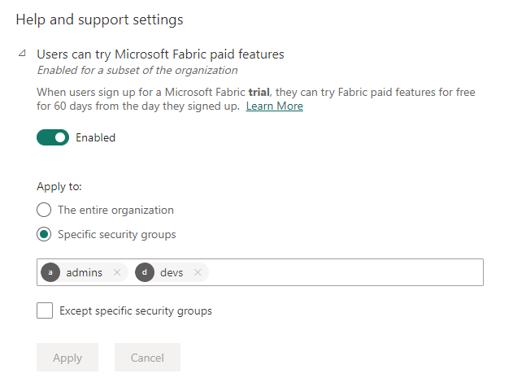
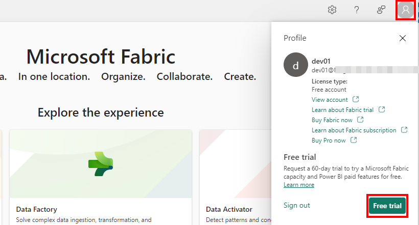
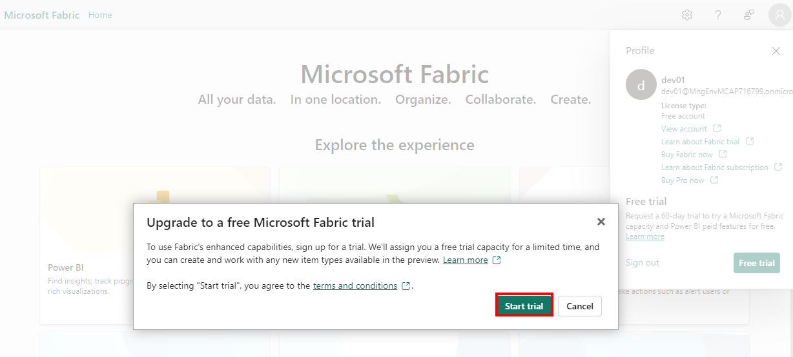
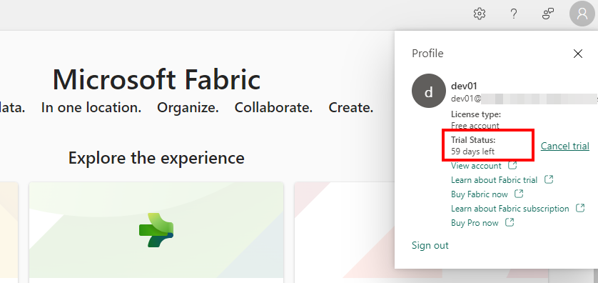
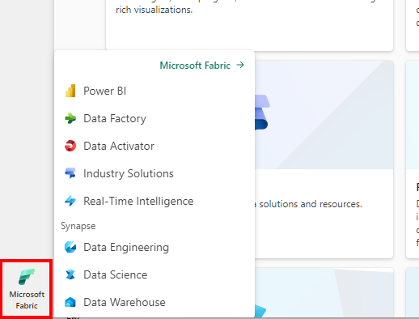
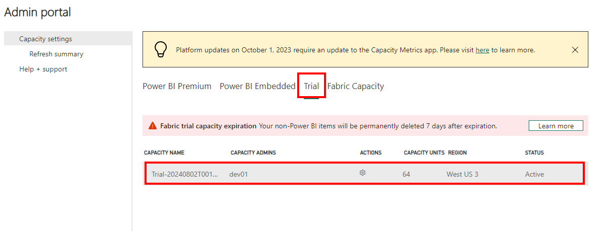
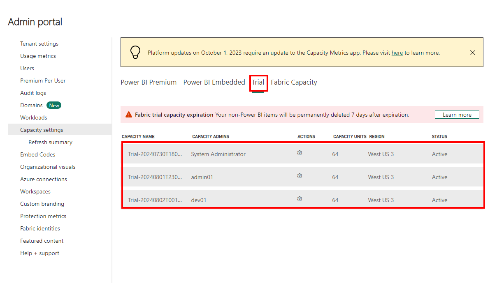
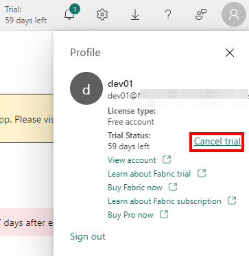
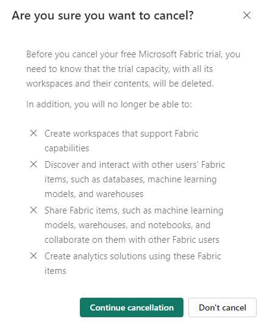

Microsoft Fabric enables users in your organization to start a free trial. The free trial is in the form of an F64 trial capacity that gets provisioned in your tenant. Each user starting a fabric trial will create a new fabric trial capacity. The capacity will stay for 60 days and will then be deprovisioned. Artifacts created in this capacity will be deleted.

As a Fabric Administrator, you can enable users in your organizations to create Fabric trials using the tenant setting:

An eligible user can start a free trial by going to their profile widget and clicking "Free trial"

A pop up will verify the user's intent to start a trial:

Once the trial is started the user will be able to see the days remaining in the trial.

The user will then have access to all Fabric experiences.

By default, the user will be assigned as the new Trial capacity admin.

As a Fabric administrator, you can see all the trial capacities created in your Fabric tenant under capacity settings.

A user can cancel their own trial by going to their profile widget and clicking "Cancel trial"

Cancelling the trial will essentially delete the capacity, all the workspaces assigned to it, and all Fabric items created on it.

In addition, the user will not be able to create any further trial capacities.

