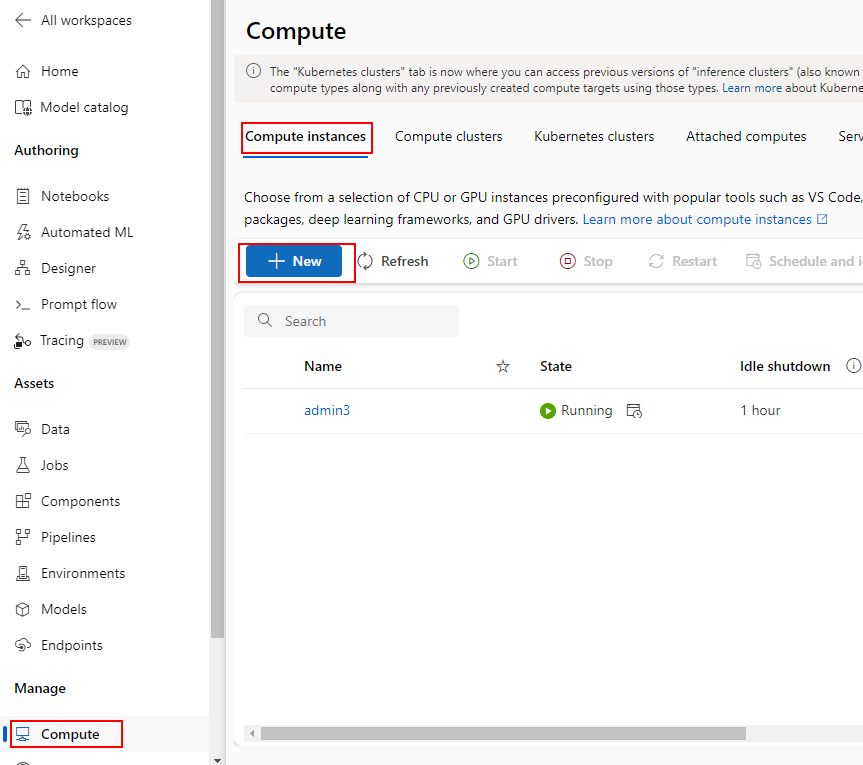
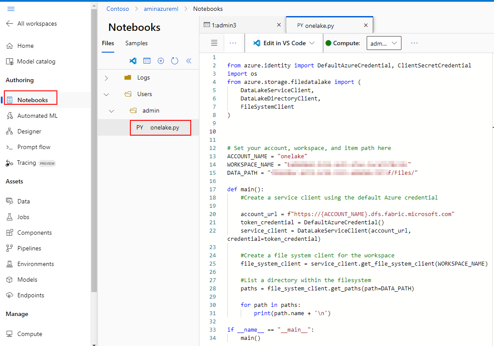
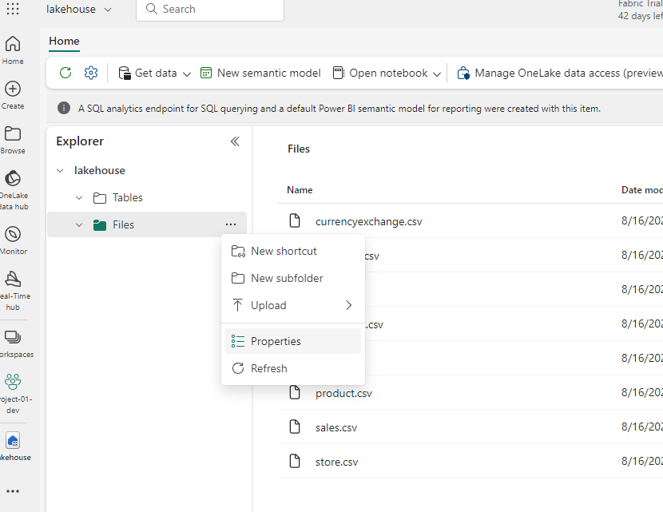
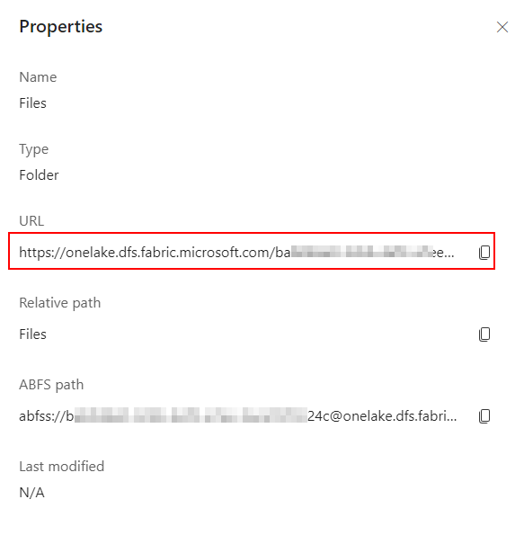
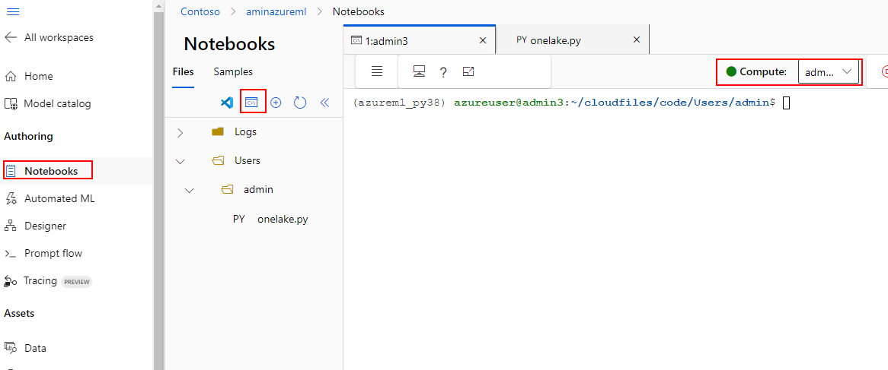
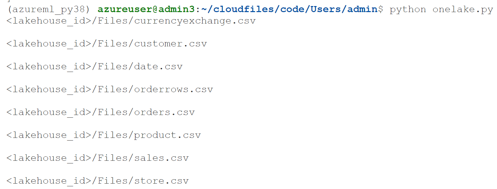

Here is a workaround to access data from OneLake in Azure ML. 

It uses Python and Notebooks to read data from OneLake.


Create a compute instance

  


From Notebooks create a new .py file or .ipynb. Use the following code: https://learn.microsoft.com/en-us/fabric/onelake/onelake-access-python#sample




You can get "myWorkspace" and "myLakeHose" from the Lakehouse properties URL. The URL is formatted as follows: https://onelake.dfs.fabric.microsoft.com/myWorkspace/myLakehouse/Files


                                        

To run the code in Notebooks, open a terminal and attach it to your compute. 


In the command line. install Azure storage and Azure identity packages:```$pip install azure-storage-file-datalake azure-identity```

Navigate to the location of your Python file: For example: ```$cd ~/cloudfiles/code/Users/admin```

The code uses Default credentials of the logged in user from the command line. Login using using: ```$az login --identity```

Make sure the logged in user has access to the files in the Fabric Lakehouse

Run the Python file to list the files in the OneLake/Files directory: ```$python ./onelake.py```

If it succeeds, you should see the files listed:

