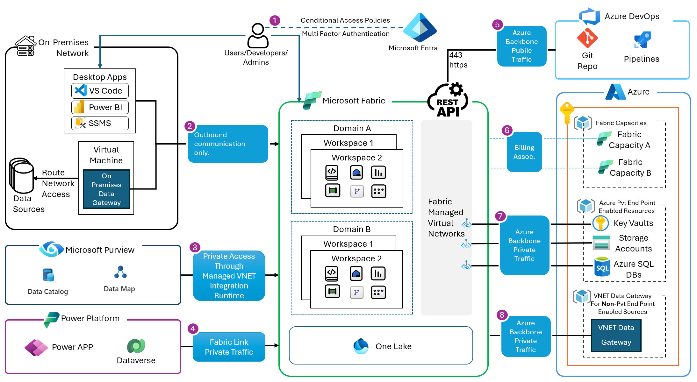

This article describes the integration points between Microsoft Fabric and other services such as on-premises data sources, Power Apps, Azure DevOps and Azure services and data sources.

### Integration points
1. Users, developers, and admins are authenticated through Microsoft Entra. At the time of authentication, an Entra Conditional Access Policies are applied. These policies include Multi-Factor Authentication (MFA) policies, device locations, IP range, and other signals.

2. On-premises networks hosting desktop tools such as Power BI desktop, SSMS, and VS Code will require outbound port whitelisting to respective Fabric endpoints. These can be found here and here. Access to on-premises data sources is done using the On-Premises Data Gateway (OPDG). The OPDG is a Microsoft 1st party tool that facilitates communication with private on-premises data sources through outbound only communication. The OPDG is an executable that is installed on Windows server or VM. OPDG requires outbound whitelisting of certain ports.

3. Microsoft Purview can connect to Fabric using Azure Runtime, Self-hosted Integration Runtime or Managed VNet Integration Runtime. The choice depends on whether public access is allowed or denied in Fabric. More information on the scenarios can be found here. Communications between Microsoft Purview and the Microsoft Fabric tenant happens over the Microsoft Network backbone.

4. Power Platform Dataverse: privately communicates to Microsoft Fabric through the link to Microsoft Fabric feature in Dataverse. This establishes OneLake shortcuts to tables in Dataverse. The Link to Fabric features establishes a managed private channel between OneLake and Dataverse.

5. Azure DevOps uses agent pools to communicate over Https (443) through the Microsoft Network Backbone to Fabric REST APIs.

6. Fabric Capacities are billing resources in Azure. There is no network traffic in this link. This capacity is used for billing purposes only.

7. Azure services and data sources that support managed private endpoints to Fabric can be connected to Fabric using managed private endpoints. These private endpoints establish a secure and private communication channel from Fabric to the Azure resources. This communication is outbound from Fabric to Azure. Here are the supported sources.

8. Azure services and data sources that do not support managed private endpoints can still communicate private with Fabric through the managed VNET Data Gateway.

There are a lot of details within each of these integration points. In future articles I will provide deeper dives into each of the integration points.